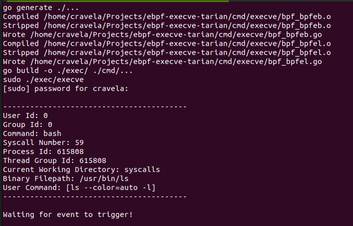

> # Environment
> - OS: `Linux VM`
> - Linux Distros: `Ubuntu 22.04`
> - kernel version: `5.19.0-35-generic`
> - Arch: `x86_64`
> - VMware


> # Dependencies
> - go
>   - version: 1.18.1
> ```bash
> sudo apt install golang
> ```
> - Clang
>   - version: 14.0.0.1ubuntu1
> ```bash
> sudo apt install clang
> ```
> - make
> ```
> sudo apt install make
> ```
<!-- > - libelf-dev
> ```
> sudo apt install libelf-dev
> ```
> - bpftool
> ```
> sudo apt install linux-tools-$(uname -r)
> ``` -->


> # Build
> ```
> make build
> ````
> Make use of this command to rebuild the programs.  
> Executable are saved to `exec/` folder.

> # Run
> ```
> make run
> ```
> Executes the ebpf execve programs. Captures the all `execve entry sycalls` and prints it to console.

> # Clean
> ```
> make clean
> ```
> Deletes all the generated files.

> # Sample Output
> 