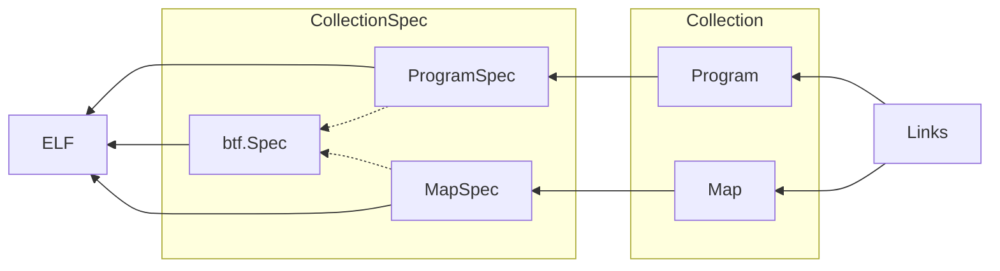

# BPF-XDP 

eBPF (extended Berkeley Packet Filter) XDP (Express Data Path) programs are a type of eBPF program that are attached to a network interface using the XDP hook. The XDP hook is a low-level hook that allows eBPF programs to be executed early in the packet receive path, before the packet is passed up the network stack.

XDP programs can be used to perform various packet processing tasks, such as filtering, forwarding, modifying, or collecting statistics on network traffic. Because they execute in the kernel, they have access to low-level network metadata and can be used to implement advanced networking features that would otherwise require kernel modifications.

The XDP hook (eXpress Data Path) is a hook in the Linux kernel that allows for packet processing at the earliest possible stage in the networking stack. It provides a low-level interface to packet filtering and manipulation, and is often used for high-performance network processing.

XDP programs are written in C and compiled into eBPF bytecode using the LLVM compiler. The eBPF bytecode is then loaded into the kernel using the bpf system call. Once loaded, the XDP program can be attached to a network interface.

## Cilium ebpf

Cilium is an open-source project that provides a networking and security solution for containerized applications that leverages eBPF technology. The __Cilium eBPF library__ provides a Go interface to the eBPF subsystem, making it easier to write eBPF programs in Go.

The Cilium eBPF library is a Go library that provides abstractions over eBPF programs and maps, as well as helpers for loading and attaching eBPF programs to various hooks in the Linux kernel.

[Refer Cilium ebpf repository](https://github.com/cilium/ebpf)

[Refer ebpf Official Documentation ](https://pkg.go.dev/github.com/cilium/ebpf)

### Architecture of library

[Refer for architecture](https://github.com/cilium/ebpf/blob/master/ARCHITECTURE.md)


## XDP hook

 The __XDP hook (eXpress Data Path)__ is a hook in the Linux kernel that allows for packet processing at the earliest possible stage in the networking stack. It provides a low-level interface to packet filtering and manipulation, and is often used for high-performance network processing.
 The XDP hook is one of the hooks that Cilium provides an abstraction for.

## Cilium ebpf project structure

```
$tree xdp
xdp
|----bpf_bpfeb.go
|----bpf_bpfeb.o
|----bpf_bpfel.go
|----bpf_bpfel.o
|----main.go
|____xdp.c    

0 directories,6 files
```
The ebpf program's source code file,__xdp.c__ in the diagram, is compiled using __bpf2go__, a code generation tool provided by cilium/ebpf. 
bpf2go uses the clang compiler to generate two ebpf bytecode files: "bpf_bpfeb.o" for big-endian and "bpf_bpfel.o" for little-endian systems. Additionally, bpf2go generates "bpf_bpfeb.go" or "bpf_bpfel.go" files based on the corresponding bytecode file. 
These go source files contain the ebpf program's bytecode as binary data.

The "main.go" file is responsible for the user state of the ebpf program. Compiling "main.go" with either "bpf_bpfeb.go" or "bpf_bpfel.go" creates the final ebpf program.


[Read more about bpf2go](https://github.com/cilium/ebpf/tree/master/cmd/bpf2go)

## Userspace program written in __Go__ using Cilium ebpf library 

Major components you might find in this userspace eBPF program written using the Cilium eBPF library in Go are as follows:

1. **Loading** pre-compiled eBPF programs into the kernel
1. **Attaching** the eBPF program to a network interface using XDP (eXpress Data Path)
1. **Printing** the contents of the BPF hash map (source IP address -> packet count) to stdout every second using a ticker.
1. A helper function formatMapContents() to **format the contents** of the BPF hash map as a string.
1. **Error handling** for all potential errors, such as failing to load the eBPF program or failing to attach it to the network interface.

```Go

package main

import (
	"fmt"
	"log"
	"net"
	"os"
	"strings"
	"time"

	"github.com/cilium/ebpf"
	"github.com/cilium/ebpf/link"
)

```
Import statements for required Go packages and the Cilium eBPF library and link package.


```Go

// $BPF_CLANG and $BPF_CFLAGS are set by the Makefile.
//go:generate go run github.com/cilium/ebpf/cmd/bpf2go -cc $BPF_CLANG -cflags $BPF_CFLAGS bpf xdp.c -- -I../headers

```
* This part of the code generates Go code that includes the compiled eBPF program as an embedded byte array, which is then used in the main Go program without relying on external files.
* The comment indicates following line is a __Go generate directive__, genertaes Go code that includes the compiled eBPF program, defined in the C source file xdp.c, as an embedded byte array.
* The __$BPF_CLANG__ and __$BPF_CFLAGS__ environment variables are used as parameters for the command, and they are expected to be set by the Makefile.
* These environment variables specify the C compiler and its flags to use when compiling the eBPF program.

```Go
func main() {
	if len(os.Args) < 2 {
		log.Fatalf("Please specify a network interface")
	}

	// Look up the network interface by name.
	ifaceName := os.Args[1]
	iface, err := net.InterfaceByName(ifaceName)
	if err != nil {
		log.Fatalf("lookup network iface %q: %s", ifaceName, err)
	}
```
* We check that the user has provided a command-line argument specifying the network interface to attach the XDP program to. If not, the program exits with a fatal error message.
* We use the network interface name specified by the user to look up the corresponding interface object using the `net.InterfaceByName()` function. If the lookup fails, the program exits with a fatal error message.

```Go
	// Load pre-compiled programs into the kernel.
	objs := bpfObjects{}
	if err := loadBpfObjects(&objs, nil); err != nil {
		log.Fatalf("loading objects: %s", err)
	}
	defer objs.Close()
```
* This creates an empty `bpfObjects` struct and then loads pre-compiled eBPF programs into the kernel using the `loadBpfObjects()` function. 
* If the load fails, the program exits with a fatal error message. 
* If the load succeeds, a `defer` statement is used to ensure that the `Close()` method of the `bpfObjects` struct is called at the end of the function, regardless of whether it returns normally or with an error.

```Go
	// Attach the program.
	l, err := link.AttachXDP(link.XDPOptions{
		Program:   objs.XdpProgFunc,
		Interface: iface.Index,
	})
	if err != nil {
		log.Fatalf("could not attach XDP program: %s", err)
	}
	defer l.Close()
	
	log.Printf("Attached XDP program to iface %q (index %d)", iface.Name, iface.Index)
	log.Printf("Press Ctrl-C to exit and remove the program")
```

* `link.AttachXDP()` attaches the XDP program to the specified network interface. It returns a handle to the XDP program that can be used to detach it later.
* The function takes an `XDPOptions` struct that specifies the program and the network interface. `objs.XdpProgFunc` is the eBPF program's entry point function.
* Definiton of [XDPOptions struct](https://github.com/cilium/ebpf/blob/03191fabe827e5bc5ec4dbccd97005ea771e38d5/link/xdp.go)

```Go
type XDPOptions struct {
	// Program must be an XDP BPF program.
	Program *ebpf.Program

	// Interface is the interface index to attach program to.
	Interface int

	// Flags is one of XDPAttachFlags (optional).
	//
	// Only one XDP mode should be set, without flag defaults
	// to driver/generic mode (best effort).
	Flags XDPAttachFlags
}
```

* If an error occurs while attaching the XDP program, the program exits with a fatal error message.defer l.Close() defers the closing of the XDP program handle until the end of the function.

```Go
	// Print the contents of the BPF hash map (source IP address -> packet count).
	ticker := time.NewTicker(1 * time.Second)
	defer ticker.Stop()
	for range ticker.C {
		s, err := formatMapContents(objs.XdpStatsMap)
		if err != nil {
			log.Printf("Error reading map: %s", err)
			continue
		}
		log.Printf("Map contents:\n%s", s)
	}
}
```
* This code prints the contents of the __BPF hash map__ to the console every second using a ticker.
* `time.NewTicker(1 * time.Second)` creates a ticker that will send a message every second.
* `defer ticker.Stop()` defers the stopping of the ticker until the end of the function.
* The `for range ticker.C` loop receives messages from the ticker channel.
* `formatMapContents()` takes the eBPF map and returns a formatted string of the map's contents.If there is an error reading the map, the error message is printed to the console, and the loop continues.

```Go
func formatMapContents(m *ebpf.Map) (string, error) {
	var (
		sb  strings.Builder
		key []byte
		val uint32
	)
	iter := m.Iterate()
	for iter.Next(&key, &val) {
		sourceIP := net.IP(key) // IPv4 source address in network byte order.
		packetCount := val
		sb.WriteString(fmt.Sprintf("\t%s => %d\n", sourceIP, packetCount))
	}
	return sb.String(), iter.Err()

```

This takes an eBPF map as input, iterates over the key-value pairs in the map, and returns a string representation of the map's contents. Here's what each line of the function does:

* `func formatMapContents(m *ebpf.Map) (string, error) {` defines the function with a parameter `m` representing the eBPF map to be formatted and a return type of a string and an error.
	* `var (` defines multiple variables in a single line.
		* `sb strings.Builder` declares a `strings.Builder` variable named `sb`. This variable is used to build up the formatted string.
		* `key []byte` declares a `[]byte` variable named `key`. This variable is used to store the key of the current key-value pair during iteration.
		* `val uint32` declares a `uint32` variable named `val`. This variable is used to store the value of the current key-value pair during iteration.

	* `iter := m.Iterate()` creates a new iterator for the given eBPF map `m`. The `Iterate` method returns an iterator object which is used to iterate over the map's key-value pairs.
	* `for iter.Next(&key, &val) {` starts a loop that iterates over the map's key-value pairs.
		*  The `Next` method of the iterator object returns `true` if there are more key-value pairs to be iterated over, and assigns the current key and value to the variables passed as pointers to it.
		* `sourceIP := net.IP(key)` converts the `[]byte` key into an `net.IP` object representing the IPv4 source address in network byte order. This is necessary because the eBPF map stores IP addresses as byte arrays.
		* `packetCount := val` stores the value of the current key-value pair in the `packetCount` variable.
		* `sb.WriteString(fmt.Sprintf("\t%s => %d\n", sourceIP, packetCount))` formats the current key-value pair as a string and writes it to the `sb` string builder.
	* `return sb.String(), iter.Err()` returns the final string representation of the eBPF map's contents as well as any error that occurred during iteration. 
	* The `String` method of the `strings.Builder` object returns the built string, and the `Err` method of the iterator object returns any error that occurred during iteration.

## Kernel Space eBPF program

```Go
//go:build ignore
```
This is a build constraint for Go. It specifies that this file should be ignored by the Go build system.

```C
#include "bpf_endian.h"
#include "common.h"
```
Header files that provide some utility functions and macros that are used in the program  defined in the Cilium eBPF library.

* bpf_endian.h: This header file defines macros for converting between host and network byte order. It is used to ensure that the program works correctly on different endianness architectures (either big-endian or little-endian).
* common.h: This header file contains common definitions and macros used by the program, such as the Ethernet protocol (ETH_P_IP),XDP pass/fail return codes (XDP_PASS and XDP_DROP), including macro definitions for BPF_MAP_TYPE_LRU_HASH

```C
char __license[] SEC("license") = "Dual MIT/GPL";
```

This specifies the license for the program.

* This line declares a character array named `__license` and assigns it a value of `"Dual MIT/GPL"`.
* The `SEC("license")` attribute attached to the declaration is used by the eBPF verifier to place this data into a specific section of the eBPF object file. In this case, the license section.
	
Note : In Linux kernel programming and eBPF programming, the **__license** variable is used to specify the license under which the code is distributed. The Linux kernel is distributed under the GNU GPL license, but some parts of it may be licensed under other open source licenses, such as the MIT license. This line is used to indicate that the eBPF code in question is dual-licensed under both the MIT and GPL licenses.

```C
#define MAX_MAP_ENTRIES 16
```
This defines the maximum number of entries that the LRU hash map can hold.


```C
/* Define an LRU hash map for storing packet count by source IPv4 address */
struct {
	__uint(type, BPF_MAP_TYPE_LRU_HASH);
	__uint(max_entries, MAX_MAP_ENTRIES);
	__type(key, __u32);   // source IPv4 address
	__type(value, __u32); // packet count
} xdp_stats_map SEC(".maps");

```
This is defining an LRU hash map data structure called xdp_stats_map that will be stored in the maps section of the compiled BPF program.
```
The following configuration attributes are needed when creating the eBPF map:

union bpf_attr {
 struct { /* anonymous struct used by BPF_MAP_CREATE command */
        __u32   map_type;       /* one of enum bpf_map_type */
        __u32   key_size;       /* size of key in bytes */
        __u32   value_size;     /* size of value in bytes */
        __u32   max_entries;    /* max number of entries in a map */
        __u32   map_flags;      /* prealloc or not */
 };
}
```
* `struct { ... } xdp_stats_map` - Defines a structure named xdp_stats_map.
* `__uint(type, BPF_MAP_TYPE_LRU_HASH);` - Sets the type field of the structure to BPF_MAP_TYPE_LRU_HASH, indicating that this is a hash map with least-recently-used eviction policy.
* `__uint(max_entries, MAX_MAP_ENTRIES);` - Sets the max_entries field of the structure to the maximum number of entries that the hash map can hold. MAX_MAP_ENTRIES is a preprocessor macro that is defined elsewhere in the program.
* `__type(key, __u32);` - Sets the key field of the structure to the data type used as the key in the hash map. In this case, it's a 32-bit unsigned integer (__u32) representing the source IPv4 address.
* `__type(value, __u32);` - Sets the value field of the structure to the data type used as the value in the hash map. In this case, it's also a 32-bit unsigned integer (__u32) representing the packet count.
* `SEC(".maps")` - Sets the section in which the xdp_stats_map structure will be stored when the BPF program is compiled. In this case, it will be stored in the maps section, which is reserved for BPF maps.

[Learn more about different types of eBPF maps and how to create them](https://prototype-kernel.readthedocs.io/en/latest/bpf/ebpf_maps_types.html#types-of-ebpf-maps)

```C
SEC("xdp")
```
This is a C macro that tells the eBPF compiler that this function should be compiled as an __XDP program__. xdp is the name of the section where this program will be loaded.

```C
int xdp_prog_func(struct xdp_md *ctx) {
```
This is the definition of the XDP program. It takes a single argument __struct xdp_md *ctx__ which contains metadata about the received packet.
The parameter struct xdp_md *ctx is a pointer to a metadata structure that contains information about the incoming packet that the XDP program is processing.
This metadata structure, xdp_md, is defined in the [/include/uapi/linux/bpf.h](https://elixir.bootlin.com/linux/latest/source/include/uapi/linux/bpf.h) header file and contains various fields, such as pointers to the start and end of the packet data, the incoming interface index, and the packet's hardware headers.

```C
struct xdp_md {
	__u32 data;
	__u32 data_end;
	__u32 data_meta;
	/* Below access go through struct xdp_rxq_info */
	__u32 ingress_ifindex; /* rxq->dev->ifindex */
	__u32 rx_queue_index;  /* rxq->queue_index  */

	__u32 egress_ifindex;  /* txq->dev->ifindex */
};
```
The XDP program is a program that runs in the kernel space of the operating system and is executed when an incoming packet is received by the network interface card. The XDP program processes the packet, and then either forwards it to the next network stack layer, or drops it.

```C
	__u32 ip;
	if (!parse_ip_src_addr(ctx, &ip)) {
		// Not an IPv4 packet, so don't count it.
		goto done;
	}
```
This block of code attempts to parse the source IP address from the received packet using the parse_ip_src_addr function. If the function returns 0, it means that the packet is not an IPv4 packet, so the program skips to the end of the function using a goto statement.

```
__u32 *pkt_count = bpf_map_lookup_elem(&xdp_stats_map, &ip);
if (!pkt_count) {
	// No entry in the map for this IP address yet, so set the initial value to 1.
	__u32 init_pkt_count = 1;
	bpf_map_update_elem(&xdp_stats_map, &ip, &init_pkt_count, BPF_ANY);
} else {
	// Entry already exists for this IP address,
	// so increment it atomically using an LLVM built-in.
	__sync_fetch_and_add(pkt_count, 1);
}
```
* If the packet is an IPv4 packet, this block of code uses the `bpf_map_lookup_elem` function to look up the packet count for the source IP address in the `xdp_stats_map` hash map. 
* If there is no entry in the map for the IP address, the program inserts a new entry with an initial packet count of 1 using the `bpf_map_update_elem` function.
* If there is already an entry in the map for the IP address, the program increments the packet count atomically using the `__sync_fetch_and_add` built-in function.

```C
done:
	// Try changing this to XDP_DROP and see what happens!
	return XDP_PASS;
}
```
* This block of code is the end of the XDP program. 
* If the packet is not an IPv4 packet, the program jumps to the done label and returns `XDP_PASS`, indicating that the packet should be passed through to the next program in the chain. 
* If the packet is an IPv4 packet, the program increments the packet count and also returns `XDP_PASS`.
*  By default, `XDP_PASS` indicates that the packet should be passed through to the next program in the chain, it can be changed to `XDP_DROP` to drop the packet.

# Repository structure

```
$ebpf-network
|==go.mod
|==go.sum
|==Readme.md
|==headers
|--------bpf_endian.h
|--------bpf_helper_defs.h
|--------bpf_helpers.h
|--------bpf_tracing.h
|--------common.h
|--------update.sh
|===xdp
|--------bpf_bpfeb.go
|--------bpf_bpfeb.o
|--------bpf_bpfel.go
|--------bpf_bpfel.o
|--------main.go
|________xdp.c   
```

## go.mod and go.sum

* `go.mod` and `go.sum` are two files used by the Go programming language to manage dependencies of a project.

* `go.mod` file defines the module's dependencies and metadata, including the module's name, version, and requirements for other modules. 
* It also includes the Go version that the module is compatible with. The go.mod file is created and updated using the go mod command-line tool.
* `go.sum` file contains the expected cryptographic checksums of the modules that are required by the go.mod file. It helps to ensure the integrity and security of the dependencies, preventing unauthorized modifications. It is automatically generated and updated by Go modules when dependencies are downloaded.

Together, go.mod and go.sum provide a simple and reliable way to manage dependencies in Go projects, making it easy to share code with others and to keep track of updates and changes in dependencies.

## Generate go.mod

To generate a go.mod file for a Go project, you can use the go mod init command followed by the name of your module.

For example, if your project is named "myproject", you would run:

```
go mod init myproject
```
This will create a go.mod file in your project directory, which will contain the module name and any required dependencies.

## Generate go.sum
Run the following command:

```
go mod tidy
```
This will update the go.sum file with the latest checksums for all the modules used in your project.

## Headers

These are the headers provided by Cilium ebpf library.

* `bpf_helpers.h`: Defines helper functions provided by the kernel to eBPF programs, such as map lookup and modification, packet I/O operations, and synchronization primitives.
* `bpf_endian.h`: Provides conversion functions for different endianness of the data, as the eBPF program runs on a different endianness than the user space program.
* `bpf_core_read.h`: Provides functions for reading kernel data structures in eBPF programs, such as the sk_buff structure.
* `bpf_core_write.h`: Provides functions for writing to kernel data structures in eBPF programs, such as setting the return value of a system call.
* `bpf_debug.h`: Defines debugging helpers for eBPF programs, such as printing data and map contents.
* `bpf_net_helpers.h`: Provides helper functions for network-related tasks, such as TCP connection tracking and DNS lookup.
* `bpf_time_helpers.h`: Provides helper functions for timestamp and time conversion.

These headers are included in the Cilium eBPF library and can be used in eBPF C programs to interact with the kernel and perform various tasks.

## xdp

[Refer Cilium ebpf project structure](#cilium-ebpf-project-structure)

```
$tree xdp
xdp
|----bpf_bpfeb.go
|----bpf_bpfeb.o
|----bpf_bpfel.go
|----bpf_bpfel.o
|----main.go
|____xdp.c    

0 dir,6 files
```
These files are part of the Cilium eBPF library and are used to compile, load and execute eBPF programs within the Cilium datapath.The two binary formats (bpfeb and bpfel) are used to represent eBPF bytecode in different endianness, depending on the target architecture.

* `bpf_bpfeb.go` and `bpf_bpfeb.o` are related to the big-endian eBPF (bpfeb) binary format. `bpf_bpfeb.go` is the Go language binding for the bpfeb binary format, while `bpf_bpfeb.o` is the actual binary file that contains the compiled eBPF bytecode in the bpfeb format.

* `bpf_bpfel.go` and `bpf_bpfel.o` are related to the little-endian eBPF (bpfel) binary format. `bpf_bpfel.go` is the Go language binding for the bpfel binary format, while `bpf_bpfel.o` is the actual binary file that contains the compiled eBPF bytecode in the bpfel format.

# How to run

```bash
sudo -s
export BPF_CLANG=clang
go build
```

`ip link` is a command in Linux used to display and manage network interfaces.
When used without any arguments, the `ip link` command displays a list of available network interfaces on the system along with their status, state, and hardware addresses

Here is an example output of the `ip link` command:


In this example, `lo` and `wlp0s20f3` are the network interfaces on the system. 

Run the following command, note the network interface in your system

```bash
ip link
```

Execute the program 

```bash
./xdp wlp0s20f3 
```

Expected Output:


